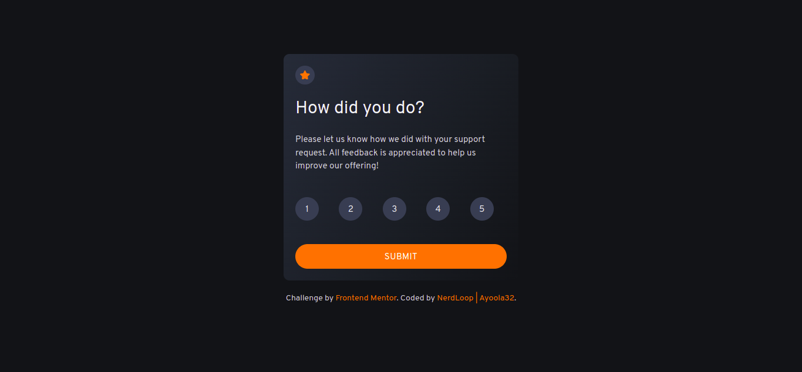
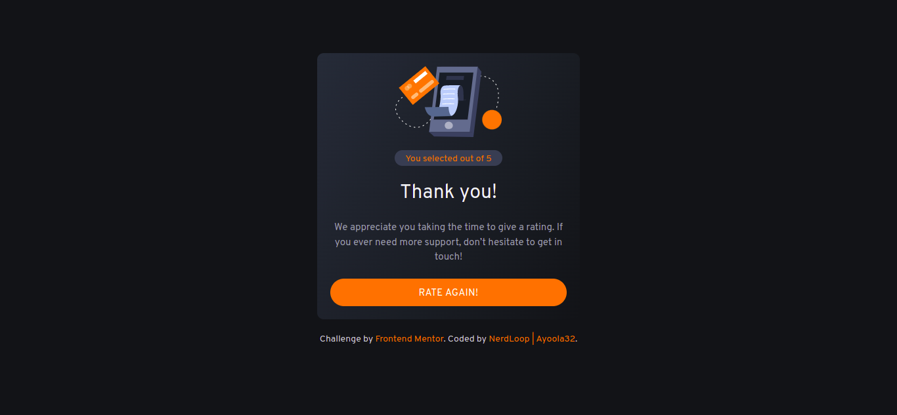

# Frontend Mentor - Interactive rating component solution

This is a solution to the [Interactive rating component challenge on Frontend Mentor](https://www.frontendmentor.io/challenges/interactive-rating-component-koxpeBUmI). Frontend Mentor challenges help you improve your coding skills by building realistic projects.

## Table of contents

- [Overview](#overview)
  - [The challenge](#the-challenge)
  - [Screenshot](#screenshot)
  - [Links](#links)
- [My process](#my-process)
  - [Built with](#built-with)
  - [What I learned](#what-i-learned)
  - [Continued development](#continued-development)
  - [Useful resources](#useful-resources)
- [Author](#author)
- [Acknowledgments](#acknowledgments)

## Overview

A Frontend Mentor project that uses React to design an interactive rating component.

### The challenge

Users should be able to:

- View the optimal layout for the app depending on their device's screen size
- See hover states for all interactive elements on the page
- Select and submit a number rating
- See the "Thank you" card state after submitting a rating

### Screenshot




### Links

- Solution URL: [Solution URL](https://github.com/Ayoola32/interactive-rating-component/tree/master/interactive-solutions)
- Live Site URL: [Live URL](https://your-live-site-url.com)

## My process

In order to improve the UI, I used ReactJS to accomplish this project.

### Built with

- Semantic HTML5 markup
- CSS custom properties
- Tailwind
- [React](https://reactjs.org/) - JS library

### What I learned

working around using arrow functions

```js
const proudOfThisFunc = () => {
  console.log("🎉");
};
```

### Continued development

This is my first complete React project, I am looking forward to execute more project using React, along the way i am willing to learn and face more challenges.
Moreso, the uses of styling framework using bootstrap and tailwind, i need to refine on that as well.

### Useful resources

- [Resource 1](https://www.stackoverflow.com)

## Author

- Website - [Interactive Rating Components](https://www.your-site.com)
- Frontend Mentor - [@Ayoola32](https://www.frontendmentor.io/profile/yourusername)
- Twitter - [@ayoola_32](https://www.twitter.com/@ayoola_32)

## Acknowledgments

All praises and adoration be onto Allah for granting me this priviledge to embark on this journey!.
